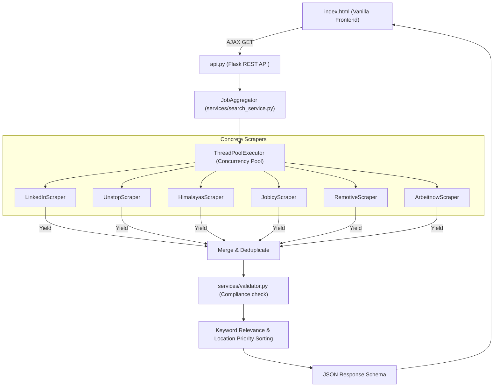

# Job Find India — Multi-Source Job Scraper & Aggregator

[](https://github.com/Ajayreddywadi/Job-Find-India/actions/workflows/ci.yml)
[](https://www.docker.com/)
[](LICENSE)
[](https://www.python.org/)

Job Find India is a professional, high-performance web aggregator for tech jobs and internships in India. It aggregates results from **LinkedIn**, **Unstop**, **Himalayas**, **Jobicy**, **Remotive**, and **Arbeitnow** concurrently using a thread-safe connection pooling architecture.

---

## 🏗️ Architecture Design



---

## ⚡ Features

| Feature | Detail |
|---|---|
| 🔍 **Smart City Search** | Fuzzy city matching — "Mysore", "Mysor", "mysuru" all resolve to Mysuru |
| 🗺️ **City Alias Normalisation** | 100+ aliases: Bangalore→Bengaluru, Bombay→Mumbai, Gurgaon→Gurugram, Vizag→Visakhapatnam, etc. |
| 📍 **City Dropdown** | Searchable autocomplete dropdown with 91+ Indian cities; keyboard navigation supported |
| 🌍 **Smart Fallback** | No results in Mysuru? Auto-falls back to Bengaluru → Karnataka → Remote → India with toast message |
| 🔄 **Parallel Scraping** | ThreadPoolExecutor fetches 6 sources simultaneously |
| 🧹 **Deduplication** | Removes duplicate job URLs across all sources |
| 📊 **Sidebar Filters** | Filter by job type, source, salary; sortable results |
| 📥 **Data Export** | Export results to CSV or JSON formats |
| 🚫 **German Filter** | Non-Indian-restricted jobs (Germany/US/UK-only) are filtered out for India searches |
| 💻 **UX Polish** | Dynamic pulsing skeleton loaders, localStorage recent search memory, and hotkey support (`/` to focus) |

---

## 🚀 Quick Start

### Option 1: Docker Compose (Recommended)
Launch the entire stack (Flask backend + Nginx frontend) with a single command:
```bash
docker-compose up --build
```
* Frontend available at: `http://localhost:8000`
* Backend REST API available at: `http://localhost:5000`

### Option 2: Local Installation

1. **Install Dependencies:**
   ```bash
   pip install -r requirements.txt
   ```
2. **Start the API backend:**
   ```bash
   python api.py
   ```
3. **Serve the Frontend:**
   Use Nginx, Live Server, or Python HTTP Server:
   ```bash
   python -m http.server 8000
   ```
4. **Open your browser at:** `http://localhost:8000`

---

## 📜 API Documentation

### GET `/api/jobs`
Fetches and merges job postings concurrently.

**Parameters:**
* `keyword` (required): The search terms (e.g. `React Developer`).
* `location` (optional): Canonical location city (defaults to `India`).

**Example Response:**
```json
{
  "jobs": [
    {
      "title": "React Developer",
      "company": "Infosys",
      "location": "Bengaluru, Karnataka, India",
      "url": "https://www.linkedin.com/jobs/view/...",
      "source": "LinkedIn",
      "date_posted": "2026-08-01",
      "job_type": "Full-time",
      "tags": "LinkedIn, Careers",
      "description": "Apply directly on LinkedIn...",
      "salary": ""
    }
  ],
  "fallback_used": false,
  "fallback_message": "",
  "searched_location": "bengaluru",
  "count": 1
}
```

---

## 🧪 Testing

Execute the test suite using `pytest`:
```bash
python -m pytest
```

---

## 🗺️ Roadmap & Future Scope
* **Cache Layer:** Integrate lightweight SQLite requests-caching to decrease API load times.
* **Email Alerts:** Schedule daily alerts for new jobs matching user search profiles.
* **Salary Analytics:** Include simple charts highlighting average salaries per technology node.
